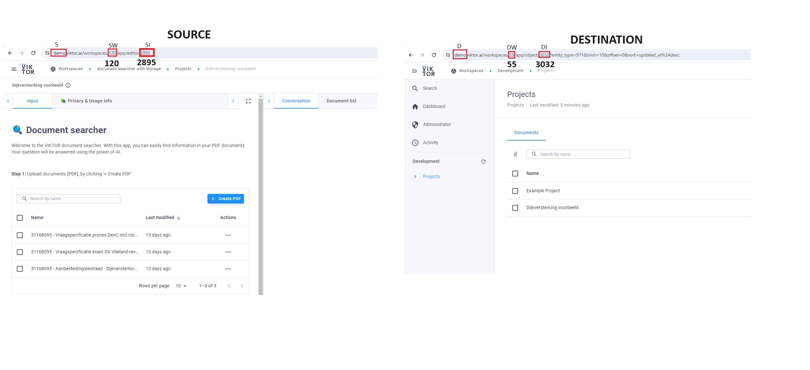

# READ THIS FIRST
SERIOUS, IRREVERSIBLE DAMAGE CAN BE DONE WITH THIS TOOL TO YOUR ENVIRONMENT AND DATABASES.
USE FOR EXPERT DEVELOPERS ONLY. USE AT OWN RISK. 

# Disclaimer
VIKTOR B.V. PROVIDES THIS SOFTWARE ON AN "AS IS" BASIS, WITHOUT WARRANTY OF ANY KIND, EXPRESS OR IMPLIED, INCLUDING BUT
NOT LIMITED TO THE WARRANTIES OF MERCHANTABILITY, FITNESS FOR A PARTICULAR PURPOSE AND NONINFRINGEMENT. IN NO EVENT
SHALL THE AUTHORS OR COPYRIGHT HOLDERS BE LIABLE FOR ANY CLAIM, DAMAGES OR OTHER LIABILITY, WHETHER IN AN ACTION OF
CONTRACT, TORT OR OTHERWISE, ARISING FROM, OUT OF OR IN CONNECTION WITH THE SOFTWARE OR THE USE OR OTHER DEALINGS IN THE
SOFTWARE.

# Viktor Development Tools
This repository is a collection of tools to make life easier for VIKTOR-developers. Some important features include:

- Copy entities: Copy entities from your production environment to your development environment for debugging
- Stash database and stash database apply: Allows for working on multiple apps simultaneously, without having to set all 
parametrizaiton manually.

# Installation
We have created a pip-installable package that will download the necessary dependencies for you. This will also create a
CLI executable (`dev-cli`).

The current implementation of the cli has been tested on both Windows and Linux. Tested and working for Python versions 3.8 up to 3.11.

## Pip-installing from GitHub
Recommended to create a virtual environment. Navigate to desired installation map. For example:

```bash
C:\WORK\PYTHON
```

Create virtual envrironment
```bash
python -m venv venv
```

Activate virual environment
```bash
venv\Scripts\activate
```

Pip install directly from the repository:
```bash
pip install git+https://github.com/viktor-platform/development-tools.git@main
```

# Using the Development Tools
To use the tools/scripts in this repository, you can simply call:
```bash
dev-cli -h
```
which looks something like this:
```commandline
Usage: dev-cli [OPTIONS] COMMAND [ARGS]...

  This is the development tools command line interface.

  It contains the help explanation of all subcommands that are available.

Options:
  -h, --help  Show this message and exit.

Commands:
  copy-entities      Copy entities between domains.
  download-entities  Download entities from domains.
  stash-database     Stashes the database from some domain, and applies it...
  upgrade            Upgrade the cli dependencies.
```

The `-h` option should provide enough help for each of the available commands.

## Copy entities
Copies entities from source workspace to destination workspace, for example from production to development environment. 

Please be careful, all entities are OVERWRITTEN. Wrong use of this functionality can do IRREVERSIBLE DAMAGE to your database, for example when you accidently overwrite your production database with your development database.

Sample use for copying entities:
```bash
dev-cli copy-entities -u username@viktor.ai -s demo -si 2895 -di 3032 -sw 120 -dw 55
```


Note:
Make sure that the root entities are similar. This can be achieved by running the app you are trying to copy in 
your development environment.

## Download entities
Download entities to a local file folder.

Sample use for downloading entities:
```bash
dev-cli download-entities -s demo -d C:\WORK\PYTHON\download_map -u username@viktor.ai -etn 'Projects' -sw 55
```
## Stash database
Stash database and apply database for later use.

Please be careful, all entities are OVERWRITTEN. Wrong use of this functionality can do IRREVERSIBLE DAMAGE to your database, for example when you accidently overwrite your production database with your development database.


Sample use for stashing the database:
```bash
dev-cli stash-database -u username@viktor.ai -s demo -d C:\WORK\PYTHON\download_map -f dev-environment.json -sw 55
```

Sample use for applying the stashed database:
```bash
dev-cli stash-database -u username@viktor.ai -s demo -d C:\WORK\PYTHON\download_map -f dev-environment.json -sw 55 --apply
```
Note: Make sure you have an instance of the app running in your development environment when you apply the database.


# Limitations
- Storage() is currently not supported
- Creating root entity is not possible
- Non-EU currently not supported
